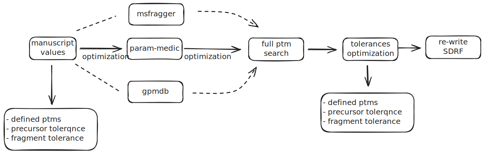

## Parameter optimizations using SAGE

This project aims to optimize the following parameters for a given SDRF annotation: 
- precursor tolerance. 
- fragment tolerance. 
- Post-translation modifications to be considered. 

The tool provides a set of tools and utilities for optimizing each of the parameters.



### Requirements

To run this project, ensure you have the following installed:

```yaml
Python 3.7+
numpy
pandas
matplotlib
click
```

You can install the required Python packages using the following command:

```bash
conda install numpy pandas matplotlib click sage-proteomics
```

Additionally, you can use the enviroment.yaml and create the conda enviroment using the following command: 

```bash
conda env create -f environment.yml
```

### Setup

Clone the repository and navigate to the project directory. Install the required packages:

### Project Structure

```bash
python opt_params.py tolerances --fragment-type ppm --mzml-path /path/to/mzml --initial-fragment-tolerance 20 --initial-precursor-tolerance 20 --min-fragment-tolerance 1 --max-fragment-tolerance 50 --min-precursor-tolerance 10 --max-precursor-tolerance 50 --fasta-file /path/to/fasta --sage-config-file /path/to/sage_config.json --max-iterations 10
```
Parameters: 
- `fragment-type`: The type of fragment tolerance to optimize. Options are `ppm` or `da`.
- `mzml-path`: The path to the mzML files.
- `initial-fragment-tolerance`: The initial fragment tolerance value.
- `initial-precursor-tolerance`: The initial precursor tolerance value.
- `min-fragment-tolerance`: The minimum fragment tolerance value.
- `max-fragment-tolerance`: The maximum fragment tolerance value.
- `min-precursor-tolerance`: The minimum precursor tolerance value.
- `max-precursor-tolerance`: The maximum precursor tolerance value.
- `fasta-file`: The path to the FASTA file.
- `sage-config-file`: The path to the SAGE configuration file.
- `max-iterations`: The maximum number of iterations for the optimization.

```bash
python opt_params.py ptms --mzml-path /path/to/mzml --fasta-file /path/to/fasta --sage-config-file /path/to/sage_config.json
```

Parameters:
- `mzml-path`: The path to the mzML files.
- `fasta-file`: The path to the FASTA file.
- `sage-config-file`: The path to the SAGE configuration file.

